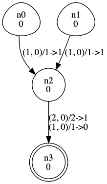

# Genetic Algorithm Framework for Evolving Spiking Neural P Systems with Rules on Synapses (RSSNP)

This is a genetic algorithm implementation for transforming RSSNPs into ones with less resources.
This implementation assumes that the number of neurons in the systems are fixed and will not be changed throughout the whole process.

## Directory Structure

In this project, you will find many folders. Here is the general usage of these:

### src

This folder contains all important source code dedicated to creating, simulating and rendering RSSNP systems as well as running the Genetic Algorithm framework.

Feel free to save source codes in this folder.

Inside you will find a folder named `abstracts`. 

### abstracts

This folder is the main backbone of the Genetic Algorithm Framework and the RSSNP simulator. **Do not delete any files inside this folder.**

### Others

Any other folder found are not very important. We have provided some sample input-output spike train pairs in `test cases`. Feel free to use them as you like.

## Getting Started

### Installing

1. Install Python3.
    ```bash
    sudo apt-get install python
    ```

2. Download virtualenv from pip.

    ```bash
    pip install virtualenv
    ```

3. Create a virtual environment. Replace [your preferred name] with a string that's easy to type for you.
    ```bash
    virtualenv [your preferred name]
    ```

4. Start the virtual environment that you just created.

    For Linux/Unix systems:
    ```bash
    source [your preferred name]/bin/activate
    ```
    For Windows:
    ```bash
    source [your preferred name]/lib/activate
    ```

5. Download and install the dependencies.

    ```bash
    pip install -r requirements.txt
    ```

6. Done!

### My First RSSNP

1. Create a python file and type out the following:
```python
from src.abstracts.rssnp import assign_rssnp
from src.abstracts.grapher import draw

and_rssnp = assign_rssnp({
    'neurons': 4,
    'synapses': 3,
    'rules': [
        [0, 2, (1, 0), 1, 1, 0],
        [1, 2, (1, 0), 1, 1, 0],
        [2, 3, (2, 0), 2, 1, 0],
        [2, 3, (1, 0), 1, 0, 0], 
    ],
    'init_config': [0, 0, 0, 0],
    'rule_status': [-1 for x in range(4)],
    'input_neurons': [0, 1],
    'output_neuron': 3
})

draw(and_rssnp, "my_first_rssnp")
```

2. `assign_rssnp()` transforms the Python dictionary into an `RSSNP object` with the necessary attributes and functions. While `draw()` takes an `RSSNP object` and creates an image that represents the given RSSNP.

3. Look for a file named `my_first_rssnp.gv.png`.

4. Congratulations! You have just created your first RSSNP!

### Simulating an RSSNP

Once you have an RSSNP system, you can simulate it with `main()`.

```python
from src.abstracts.rssnp import assign_rssnp

and_rssnp = assign_rssnp({
    'neurons': 4,
    'synapses': 3,
    'rules': [
        [0, 2, (1, 0), 1, 1, 0],
        [1, 2, (1, 0), 1, 1, 0],
        [2, 3, (2, 0), 2, 1, 0],
        [2, 3, (1, 0), 1, 0, 0], 
    ],
    'init_config': [0, 0, 0, 0],
    'rule_status': [-1 for x in range(4)],
    'input_neurons': [0, 1],
    'output_neuron': 3
})

# The input spike train that will be fed to the input neurons
and_rssnp.in_spiketrain = [
    {
        'index': 0,
        'input': [0,0,1,0,0,0,1,1,1]
    },
    {
        'index': 1,
        'input': [1,0,1,1,0,0,0,1,1]
    },
    
]

system_state = (and_rssnp.configuration_init, and_rssnp.ruleStatus) # the initial configuration
maxSteps = 9 # the max number of steps before halting the simulation (this is just a safety net)
print(rssnp.main(system_state, maxSteps))
```

Running this will give you an output of `[0, 0, 0, 0, 1, 0, 0, 0, 0, 1, 1]`.

## Running the Genetic Algorithm (GA) Framework

Before using the framework, there are a few things that we need:

### 1. The Initial RSSNP

If you completed the previous tutorial, then you already know how to do it. But this time, we don't need to draw it. No need to call `assign_rssnp()` because the GA Framework will handle that for you. All you need to know is the format.

```python
initial_rssnp = {
    'neurons': 4,
    'synapses': 3,
    'rules': [
        [0, 2, (1, 0), 1, 1, 0],
        [1, 2, (1, 0), 1, 1, 0],
        [2, 3, (2, 0), 2, 1, 0],
        [2, 3, (1, 0), 1, 0, 0], 
    ],
    'init_config': [0, 0, 0, 0],
    'rule_status': [-1 for x in range(4)],
    'input_neurons': [0, 1],
    'output_neuron': 3
}
```

### 2. Set of input/output spike train pairs

To know if the RSSNPs being created are good, we need to know if the output spike train they make are what we actually want. For this, we need a basis. Create a text file (.txt) containing sets of **comma-separated bitstrings** of the format: `input1,input2,...,inputn,output` like evaluating a function. For example,

```
1001,0101,0001
01,10,00
1111,1010,1010
1100,0011,0000
0001,1001,0001
```

The lines contain binary bits that follow some sort of pattern. If you will notice, the first two bitstrings are fairly random but the third bitstring in each line is the **Bitwise AND** of the first two strings.

In order for the GA framework to work smoothly, it is recommended to use bitstrings of length not greater than 20 but it is safe to go past that.

The number of lines is up to the user but the more lines there are, the less likely it is for the GA framework to classify an unfit RSSNP as an RSSNP with high fitness. **Around 50 sets of input/output pairs is recommended.**

### 3. Genetic Algorithm Parameters

Lastly, we need to set limits on the GA framework. Specify the **population size**, **number of generations**, **mutation rate**, **fitness function**, **selection method**, and **the number of GA framework runs**.

*Note: mutation rate is calculated as 1/given value*.

The Fitness functions and their corresponding code number are as follows (we use the code number instead of the name of the function):

0. **Longest Common Substring**
1. **Longest Common Subsequence**

The Parent Selection method and their code number:

0. **Top 50% of the population**
1. **25% of the population based on fitness**
2. **Top 25% + 25% of the population based on fitness**

```python
ga_params = {
    'population_size': 12,
    'mutation_rate': 100,   # mutation rate would be 1/100 or 1% 
    'fitness_function': 1,
    'selection_func': 1,
    'generations': 5,
    'runs': 1    
}
```
So in the above example, the parameters are:

    Population size: 12
    Mutation rate: 1%
    Fitness function: Longest Common Subsequence
    Parent selection: 25% of the population based on fitness
    Max. generations: 5
    No. of runs: 1

### 4. Piecing them all together

Now that we have everything we really need, we can now use the GA framework as shown below.

```python
from src.experimenter import gaframework

initial_rssnp = {
    'neurons': 4,
    'synapses': 3,
    'rules': [
        [0, 2, (1, 0), 1, 1, 0],
        [1, 2, (1, 0), 1, 1, 0],
        [2, 3, (2, 0), 2, 1, 0],
        [2, 3, (1, 0), 1, 0, 0], 
    ],
    'init_config': [0, 0, 0, 0],
    'rule_status': [-1 for x in range(4)],
    'input_neurons': [0, 1],
    'output_neuron': 3
}

ga_params = {
    'population_size': 12,
    'mutation_rate': 100,
    'fitness_function': 1,
    'generations': 5,
    'runs': 1,
    'selection_func': 1
}

path_to_inputoutput_spike_trains = 'path/to/io_spiketrains.txt'

gaframework(initial_rssnp, path_to_inputoutput_spike_trains, ga_params)
```

Congratulations! All there's left is to wait for the GA framework to finish.

## Results
While the GA framework is running, you will notice that a folder will be created named `Run0` with a file named `run.txt` inside.

The folder (like `Run0`) indicates which run of the GA framework is being executed. The file `run.txt` contains a summary of the run and individuals in each generation together with their fitness, the output spike trains they produced with the expected output spike train given earlier. An example of the contents are as follows (some parts were truncated to save space):

```
Population size: 12
Mutation rate: 100
Fitness function: 0
Selection function: 0
Generation 0
0 {'system': [[0, 2, (1, 0), 1, 1, 0], [0, 3, (1, 0), 1, 1, 0], [1, 2, (1, 0), 1, 1, 0], [1, 4, (1, 0), 1, 1, 0], [2, 6, (1, 2), 1, 0, 0], [2, 6, (2, 2), 2, 1, 0], [3, 0, (1, 0), 1, 1, 0], [3, 2, (1, 0), 1, 1, 0], [4, 2, (1, 0), 1, 1, 0], [4, 5, (1, 0), 1, 1, 0], [5, 1, (1, 0), 1, 1, 0]] | [0, 0, 0, 0, 0, 0, 0], 'fitness': 82, 'out_pairs': [([0, 0, 0, 0, 0, 0, 0, 0, 0, 0, 0, 1, 1, 0, 0, 0, 0, 0, 0, 0, 0, 0, 0, 0, 0, 0, 0, 0, 0, 0, 0, 1, 0, 1, 1, 0, 0, 0, 0, 1, 1, 0, 0, 1, 0, 1], [0, 0, 1, 0, 0, 1, 1, 0])]}
1 {'system': [[0, 2, (1, 0), 1, 1, 0], [0, 3, (1, 0), 1, 1, 0], [1, 2, (1, 0), 1, 1, 0], [1, 4, (1, 0), 1, 1, 0], [2, 6, (1, 2), 1, 0, 0], [2, 6, (2, 2), 2, 1, 0], [3, 0, (1, 0), 1, 1, 0], [3, 2, (1, 0), 1, 1, 0], [4, 2, (1, 0), 1, 1, 0], [5, 1, (1, 0), 1, 1, 0]] | [0, 0, 0, 0, 0, 0, 0], 'fitness': 80, 'out_pairs': [([0, 0, 0, 0, 0, 0, 0, 0, 0, 0, 0, 1, 1, 0, 0, 0, 0, 0, 0, 0, 0, 0, 0, 0, 0, 0, 0, 0, 0, 0, 0, 0, 0, 0, 0, 1, 0, 1, 1, 0, 0, 0, 0, 1, 1, 0, 0, 0, 1, 1], [0, 0, 1, 0, 0, 1, 1, 0])]} 
2 {'system': [[0, 2, (1, 0), 1, 1, 0], [0, 3, (1, 0), 1, 1, 0], [1, 2, (1, 0), 1, 1, 0], [1, 4, (1, 0), 1, 1, 0], [2, 6, (1, 2), 1, 0, 0], [2, 6, (2, 2), 2, 1, 0], [3, 0, (1, 0), 1, 1, 0], [4, 2, (1, 0), 1, 1, 0], [4, 5, (1, 0), 1, 1, 0], [5, 1, (1, 0), 1, 1, 0]] | [0, 0, 0, 0, 0, 0, 0], 'fitness': 79, 'out_pairs': [([0, 0, 0, 0, 0, 0, 0, 0, 0, 0, 0, 1, 1, 0, 0, 0, 0, 0, 0, 0, 0, 0, 0, 0, 0, 0, 0, 0, 0, 0, 0, 1, 0, 0, 0, 0, 0, 1, 1, 0, 0, 0, 0, 1, 0, 1], [0, 0, 1, 0, 0, 1, 1, 0])]}
3 {'system': [[0, 2, (1, 0), 1, 1, 0], [0, 3, (1, 0), 1, 1, 0], [1, 2, (1, 0), 1, 1, 0], [1, 4, (1, 0), 1, 1, 0], [2, 6, (1, 2), 1, 0, 0], [2, 6, (2, 2), 2, 1, 0], [3, 0, (1, 0), 1, 1, 0], [3, 2, (1, 0), 1, 1, 0], [5, 1, (1, 0), 1, 1, 0]] | [0, 0, 0, 0, 0, 0, 0], 'fitness': 79, 'out_pairs': [([0, 0, 0, 0, 0, 0, 0, 0, 0, 0, 0, 1, 1, 0, 0, 0, 0, 0, 0, 0, 0, 0, 0, 0, 0, 0, 0, 0, 0, 0, 0, 0, 0, 0, 0, 0, 0, 1, 1, 0, 0, 1, 1, 0, 0, 1, 0, 0, 0, 1], [0, 0, 1, 0, 0, 1, 1, 0])]}
4 {'system': [[0, 2, (1, 0), 1, 1, 0], [0, 3, (1, 0), 1, 1, 0], [1, 2, (1, 0), 1, 1, 0], [1, 4, (1, 0), 1, 1, 0], [2, 6, (1, 2), 1, 0, 0], [2, 6, (2, 2), 2, 1, 0], [3, 0, (1, 0), 1, 1, 0], [3, 2, (1, 0), 1, 1, 0], [4, 1, (1, 0), 1, 1, 0], [4, 6, (1, 0), 1, 0, 0], [5, 1, (1, 0), 1, 1, 0]] | [0, 0, 0, 0, 0, 0, 0], 'fitness': 78, 'out_pairs': [([0, 0, 0, 0, 0, 0, 0, 0, 0, 0, 0, 0, 0, 1, 1, 0, 0, 0, 0, 0, 0, 0, 0, 0, 0, 0, 0, 0, 0, 0, 0, 0, 0, 0, 0, 0, 0, 0, 0, 0, 0, 0, 0, 0, 0, 0, 0, 0, 0, 0, 0, 1, 1, 0, 0, 0, 0, 1, 1, 1, 1, 0, 0, 0, 0, 0, 0, 0, 0, 0], [0, 0, 1, 0, 0, 1, 1, 0])]}
Generation 1
0 {'system': [[0, 2, (1, 0), 1, 1, 0], [0, 3, (1, 0), 1, 1, 0], [1, 2, (1, 0), 1, 1, 0], [1, 4, (1, 0), 1, 1, 0], [2, 6, (1, 2), 1, 0, 0], [2, 6, (2, 2), 2, 1, 0], [3, 0, (1, 0), 1, 1, 0], [3, 2, (1, 0), 1, 1, 0], [4, 2, (1, 0), 1, 1, 0], [4, 5, (1, 0), 1, 1, 0], [5, 1, (1, 0), 1, 1, 0]] | [0, 0, 0, 0, 0, 0, 0], 'fitness': 82, 'out_pairs': [([0, 0, 0, 0, 0, 0, 0, 0, 0, 0, 0, 1, 1, 0, 0, 0, 0, 0, 0, 0, 0, 0, 0, 0, 0, 0, 0, 0, 0, 0, 0, 1, 0, 1, 1, 0, 0, 0, 0, 1, 1, 0, 0, 1, 0, 1], [0, 0, 1, 0, 0, 1, 1, 0])]}
1 {'system': [[0, 2, (1, 0), 1, 1, 0], [0, 3, (1, 0), 1, 1, 0], [1, 2, (1, 0), 1, 1, 0], [1, 4, (1, 0), 1, 1, 0], [2, 6, (1, 2), 1, 0, 0], [2, 6, (2, 2), 2, 1, 0], [3, 0, (1, 0), 1, 1, 0], [3, 2, (1, 0), 1, 1, 0], [4, 2, (1, 0), 1, 1, 0], [5, 1, (1, 0), 1, 1, 0]] | [0, 0, 0, 0, 0, 0, 0], 'fitness': 80, 'out_pairs': [([0, 0, 0, 0, 0, 0, 0, 0, 0, 0, 0, 1, 1, 0, 0, 0, 0, 0, 0, 0, 0, 0, 0, 0, 0, 0, 0, 0, 0, 0, 0, 0, 0, 0, 0, 1, 0, 1, 1, 0, 0, 0, 0, 1, 1, 0, 0, 0, 1, 1], [0, 0, 1, 0, 0, 1, 1, 0])]}
2 {'system': [[0, 2, (1, 0), 1, 1, 0], [0, 3, (1, 0), 1, 1, 0], [1, 2, (1, 0), 1, 1, 0], [1, 4, (1, 0), 1, 1, 0], [2, 6, (1, 2), 1, 0, 0], [2, 6, (2, 2), 2, 1, 0], [3, 0, (1, 0), 1, 1, 0], [4, 2, (1, 0), 1, 1, 0], [4, 5, (1, 0), 1, 1, 0], [5, 1, (1, 0), 1, 1, 0]] | [0, 0, 0, 0, 0, 0, 0], 'fitness': 79, 'out_pairs': [([0, 0, 0, 0, 0, 0, 0, 0, 0, 0, 0, 1, 1, 0, 0, 0, 0, 0, 0, 0, 0, 0, 0, 0, 0, 0, 0, 0, 0, 0, 0, 1, 0, 0, 0, 0, 0, 1, 1, 0, 0, 0, 0, 1, 0, 1], [0, 0, 1, 0, 0, 1, 1, 0])]}
3 {'system': [[0, 2, (1, 0), 1, 1, 0], [0, 3, (1, 0), 1, 1, 0], [1, 2, (1, 0), 1, 1, 0], [1, 4, (1, 0), 1, 1, 0], [2, 6, (1, 2), 1, 0, 0], [2, 6, (2, 2), 2, 1, 0], [3, 0, (1, 0), 1, 1, 0], [3, 2, (1, 0), 1, 1, 0], [5, 1, (1, 0), 1, 1, 0]] | [0, 0, 0, 0, 0, 0, 0], 'fitness': 79, 'out_pairs': [([0, 0, 0, 0, 0, 0, 0, 0, 0, 0, 0, 1, 1, 0, 0, 0, 0, 0, 0, 0, 0, 0, 0, 0, 0, 0, 0, 0, 0, 0, 0, 0, 0, 0, 0, 0, 0, 1, 1, 0, 0, 1, 1, 0, 0, 1, 0, 0, 0, 1], [0, 0, 1, 0, 0, 1, 1, 0])]}
4 {'system': [[0, 2, (1, 0), 1, 1, 0], [0, 3, (1, 0), 1, 1, 0], [1, 2, (1, 0), 1, 1, 0], [1, 4, (1, 0), 1, 1, 0], [2, 6, (1, 2), 1, 0, 0], [2, 6, (2, 2), 2, 1, 0], [3, 0, (1, 0), 1, 1, 0], [3, 2, (1, 0), 1, 1, 0], [5, 1, (1, 0), 1, 1, 0]] | [0, 0, 0, 0, 0, 0, 0], 'fitness': 79, 'out_pairs': [([0, 0, 0, 0, 0, 0, 0, 0, 0, 0, 0, 1, 1, 0, 0, 0, 0, 0, 0, 0, 0, 0, 0, 0, 0, 0, 0, 0, 0, 0, 0, 0, 0, 0, 0, 0, 0, 1, 1, 0, 0, 1, 1, 0, 0, 1, 0, 0, 0, 1], [0, 0, 1, 0, 0, 1, 1, 0])]}
...
```

### System

Each individual is an RSSNP system (labelled `system`) with 2 parts separated by `|`.
```python
'system':[
    [0, 2, (1, 0), 1, 1, 0], [0, 3, (1, 0), 1, 1, 0], [1, 2, (1, 0), 1, 1, 0], [1, 4, (1, 0), 1, 1, 0], [2, 6, (1, 2), 1, 0, 0], [2, 6, (2, 2), 2, 1, 0], [3, 0, (1, 0), 1, 1, 0], [3, 2, (1, 0), 1, 1, 0], [4, 2, (1, 0), 1, 1, 0], [4, 5, (1, 0), 1, 1, 0], [5, 1, (1, 0), 1, 1, 0]]
     |
    [0, 0, 0, 0, 0, 0, 0]
]
```
The first part is the list of **rules** in the system. Each rule has 6 elements namely:

    0. The index of the source neuron
    1. The index of the destination neuron
    2. The regular expression that activates the rule a^i(a^j)*
    3. The number of spikes consumed
    4. The number of spikes produced
    5. The delay of firing the spikes to other neurons

For this study, we assume that the delay is always **0**.

The second part represents the **initial configuration of spikes** in the system. Each element in the list signifies the number of spikes in each neuron. For example, a configuration of `[0,1,0,0,2,0]` means that initially there is 1 spike in the 2nd neuron and 2 spikes in the 5th neuron.

### Fitness

Each individual is given a fitness score (labelled `fitness`) based on how similar the generated output spike train is with the given expected output spike train. These bitstrings are evaluated using either **Longest Common Substring** or **Longest Common Subsequence** depending on the GA parameters set at the beginning.

### Output spike trains

Lastly, the GA framework lists down all the generated output spike trains after simulating each RSSNP and also shows what should have been generated really by the RSSNP (these can be found under `out_pairs` in each line).

The format is ``([bitstring that was generated], [bitstring that was expected])``.

### A more visual display

If you are more interested in a more graphic and visual representation of the results, you may use `render.py` that was provided. 

Running `render.py` will prompt the user to input the following:

1. Path to `run.txt`
2. Generation number
3. Indices of the input neuron
4. Index of the output neuron
5. Desired filename of the image

After giving all of what is asked, an image of the best RSSNP will be created for viewing. For example:

